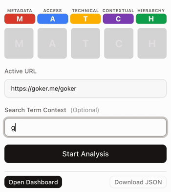

# MATCH

  
<!--  -->


<table>
  <tr>
    <td valign="top">
      <strong>MATCH</strong> is a deterministic, local-first Web Quality Linter delivered as a Chrome Extension. It evaluates a page against strict engineering and semantic standards.<br><br>
      MATCH does NOT aim to discover what a website "has".<br>
      MATCH answers: "Is what MUST exist present, and is it correct?"
    </td>
    <td valign="top" width="350">
      
    </td>
  </tr>
</table>

---

### Evaluation Pillars

<table>
  <tr>
    <td align="center" style="color:#DD4433; font-size:18px; font-weight:bold; width: 48px;">M</td>
    <td width="200px"><strong>Metadata Precision</strong></td>
    <td>Title + essential meta correctness.</td>
  </tr>
  <tr>
    <td align="center" style="color:#4488FF; font-size:18px; font-weight:bold; width: 48px;">A</td>
    <td><strong>Access Quality</strong></td>
    <td>Strict A11y baseline checks (deterministic).</td>
  </tr>
  <tr>
    <td align="center" style="color:#FFBB00; font-size:18px; font-weight:bold; width: 48px;">T</td>
    <td><strong>Technical Hygiene</strong></td>
    <td>Console/runtime/network hygiene and technical cleanliness.</td>
  </tr>
  <tr>
    <td align="center" style="color:#8844BB; font-size:18px; font-weight:bold; width: 48px;">C</td>
    <td><strong>Contextual Relevancy</strong></td>
    <td>Page content alignment with the user-provided Search Term.</td>
  </tr>
  <tr>
    <td align="center" style="color:#11AA55; font-size:18px; font-weight:bold; width: 48px;">H</td>
    <td><strong>Hierarchy Integrity</strong></td>
    <td>Structural and semantic correctness: main/article/heading integrity/landmarks.</td>
  </tr>
</table>

## Key Features

*   **Deterministic Heatmap**: 5-column strict analysis (Metadata, Access, Technical, Contextual, Hierarchy).
*   **0-Cost & Local First**: AI and logic run wholly on your machine via WebAssembly and Chrome's Built-in AI. No remote API calls.
*   **Contextual Relevancy Check**: Compare the actual layout text against a real Search Term.
*   **A11y Baseline**: Deterministic Accessibility checks powered by axe-core.
*   **Multiple Modes**:
    *   **Popup**: Instant analysis for the active tab.
    *   **Dashboard**: Batch URL analysis and historical cache tracking.
*   **JSON Report Export**: Agent/AI-friendly export artifact.

## Tech Stack

*   **Runtime / Tooling**
    *   **Bun** (Package Manager & Runtime)
    *   **TypeScript** (Strict Mode)
    *   **Vite** (Build Tool)
    *   **React 19**
*   **Core Logic**
    *   `axe-core` (Accessibility)
    *   `@xenova/transformers` (Local Embeddings & NLP)
    *   `window.ai` / Prompt API (Semantic Quality)
*   **UI & UX**
    *   **Tailwind CSS v4** (Styling)
    *   **Shadcn UI** (Component Library)
    *   **Framer Motion** (Animations)
    *   **Lucide React** (Icons)
*   **Quality & Standards**
    *   **Biome** (Linter & Formatter)
*   **Extension**
    *   `@crxjs/vite-plugin`
    *   MV3 Manifest

## Project Structure

```
src/
├── app/                # Feature modules (Dashboard, Popup logic)
├── components/         # Shared UI components (Shadcn, Common)
├── lib/                # Shared utilities
├── metrics/            # Deterministic metric plugins (M.A.T.C.H.)
├── services/           # External integrations (Chrome API, Storage, AI)
├── assets/             # Static assets
└── popup/              # Extension popup entry
```

## Installation & Development

### Prerequisites

*   [Bun](https://bun.sh/) (v1.0+)
*   Node.js (v20+)

### Setup

1.  **Clone the repository:**
    ```bash
    git clone https://github.com/goker/match
    cd match
    ```

2.  **Install dependencies:**
    ```bash
    bun install
    ```

3.  **Start Development Server:**
    ```bash
    bun dev
    ```
    This compiles the extension and app in watch mode.

4.  **Load into Chrome:**
    *   Open `chrome://extensions`
    *   Enable **Developer mode** (top right)
    *   Click **Load unpacked**
    *   Select the `dist/` folder generated in your project root

## Contributing

Contributions are welcome! Please read the [SPEC.md](./SPEC.md) for architectural details before submitting pull requests.

1.  Fork the repository
2.  Create your branch (`git checkout -b feature/amazing-feature`)
3.  Commit changes (`git commit -m 'feat: add amazing feature'`)
4.  Push branch (`git push origin feature/amazing-feature`)
5.  Open a Pull Request

### Contribution Rules
*   Follow **Conventional Commits**
*   Keep metric logic deterministic
*   Avoid `any` types (Strict TypeScript)
*   Keep comments in English
*   Run lint/format/build before PR (`bun lint`, `bun format`)

## License

Distributed under the MIT License. See `LICENSE` for more information.